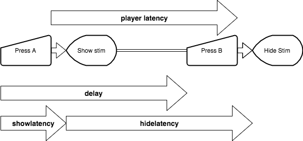

## Display timings

It takes the browser several milliseconds to display visual stimuli.
This delay is caused mainly by the screen refresh rate.
We want to get an idea of how large this delay is, and see if we can reliably measure it from within the browser 
(ideally the player can report the exact times when stimuli are shown/hidden).

### experiment 1

We use the arduino to keypress twice, at a preset interval (`delay`). 
The player displays a stimulus at the first keypress, and hides it at the second keypress.
The arduino measures the time it takes from the initial keypress to the display of the stimulus (`showlatency`).
It also measures the time from the moment the stimulus was displayed to the moment it is hidden (`hidelatency`).
The player measures the time between keypressed (`playerlatency`).

The arrows in the diagram represent the various measures as described in the following table:

Name            | Source    | Units | Description
--------------- | --------- | ----- | -----------
showlatency     | arduino   | us    | The latency between the first keypress and the appearance of the stimulus.
hidelatency     | arduino   | us    | The latency between the appearance of the stimulus and its dissapearance.
delay           | arduino   | us    | The delay before the second keypress as set for this trial.
playerlatency   | player    | ms    | The latency between the first and second keypress.

The results can be found in the [results](./results) folder.
The files are each a csv file with the content of the result of a single browser.
The results for OpenSesame can be found in [open-frame-rate.csv](./results/open-frame-rate.csv).

Notably, we needed a version of the arduino script with some additional delay to deal with the slowness of OpenSessame.

#### showlatency
`showlatency` is measured by the arduino from the moment the first key was pressed to the moment the stimulus was displayed.
It is composed of the following:

1. hardware keypress latency
2. os/browser debounce buffer (the computer reads input only so often, see [here](http://stackoverflow.com/questions/8348801/how-large-is-the-average-delay-from-key-presses))
3. player reaction time
4. time until frame

In our case 
(1) is constant (set by the arduino hardware). 
(2) depends on operating system, player type and browser. 
(3) depends on the player type. 
(4) depends on the time that the display was requested.

The imortance of this measure is in gaining some insight to the actual latency between a user action to the player  reaction.
Variability within a browser probably stems from frame-rate problems (as well as timer resolution).
Variability between browsers probably stems from different management of debouncing (2),
though it may be a function of different implementations of js code (3).

#### hidelatency
`hidelatency` is measured by the arduino from the moment the stimulus is displayed to the moment that it is hidden.
It is composed of the (constant) `delay` time, subtract the processing time for the first key (as described previously) and add the processing time for the second key.
The constant parts of the proccessing should cancel out, but variable parts of processing should add to `hidelatency` variability.
Theoretically it should always be a multiple of the frame length (16.6ms).

We test for two delays betwen the keypresses: 100ms and 110ms.
100ms is a multiple of 16.6ms which is the standard length of a frame, and is therefore expected to allow the player to hit the requested timing accuratel, and is therefore expected to allow the player to hit the requested timing accuratel, and is therefore expected to allow the player to hit the requested timing accuratel, and is therefore expected to allow the player to hit the requested timing accuratel, and is therefore expected to allow the player to hit the requested timing accuratel, and is therefore expected to allow the player to hit the requested timing accuratel, and is therefore expected to allow the player to hit the requested timing accuratel, and is therefore expected to allow the player to hit the requested timing accuratel, and is therefore expected to allow the player to hit the requested timing accuratel, and is therefore expected to allow the player to hit the requested timing accuratel, and is therefore expected to allow the player to hit the requested timing accuratel, and is therefore expected to allow the player to hit the requested timing accuratel, and is therefore expected to allow the player to hit the requested timing accuratel, and is therefore expected to allow the player to hit the requested timing accuratel, and is therefore expected to allow the player to hit the requested timing accuratel, and is therefore expected to allow the player to hit the requested timing accuratel, and is therefore expected to allow the player to hit the requested timing accuratel, and is therefore expected to allow the player to hit the requested timing accuratel, and is therefore expected to allow the player to hit the requested timing accuratel, and is therefore expected to allow the player to hit the requested timing accuratel, and is therefore expected to allow the player to hit the requested timing accuratel, and is therefore expected to allow the player to hit the requested timing accuratel, and is therefore expected to allow the player to hit the requested timing accuratel, and is therefore expected to allow the player to hit the requested timing accuratel, and is therefore expected to allow the player to hit the requested timing accuratel, and is therefore expected to allow the player to hit the requested timing accuratel, and is therefore expected to allow the player to hit the requested timing accuratel, and is therefore expected to allow the player to hit the requested timing accuratel, and is therefore expected to allow the player to hit the requested timing accuratel, and is therefore expected to allow the player to hit the requested timing accuratel, and is therefore expected to allow the player to hit the requested timing accuratel, and is therefore expected to allow the player to hit the requested timing accuratel, and is therefore expected to allow the player to hit the requested timing accuratel, and is therefore expected to allow the player to hit the requested timing accuratel, and is therefore expected to allow the player to hit the requested timing accuratel, and is therefore expected to allow the player to hit the requested timing accuratel, and is therefore expected to allow the player to hit the requested timing accuratel, and is therefore expected to allow the player to hit the requested timing accuratel, and is therefore expected to allow the player to hit the requested timing accuratel, and is therefore expected to allow the player to hit the requested timing accuratel, and is therefore expected to allow the player to hit the requested timing accuratel, and is therefore expected to allow the player to hit the requested timing accuratel, and is therefore expected to allow the player to hit the requested timing accuratel, and is therefore expected to allow the player to hit the requested timing accuratel, and is therefore expected to allow the player to hit the requested timing accuratel, and is therefore expected to allow the player to hit the requested timing accuratel, and is therefore expected to allow the player to hit the requested timing accuratel, and is therefore expected to allow the player to hit the requested timing accuratel, and is therefore expected to allow the player to hit the requested timing accuratel, and is therefore expected to allow the player to hit the requested timing accuratel, and is therefore expected to allow the player to hit the requested timing accuratel, and is therefore expected to allow the player to hit the requested timing accuratel, and is therefore expected to allow the player to hit the requested timing accuratel, and is therefore expected to allow the player to hit the requested timing accuratel, and is therefore expected to allow the player to hit the requested timing accuratel, and is therefore expected to allow the player to hit the requested timing accuratel, and is therefore expected to allow the player to hit the requested timing accuratel, and is therefore expected to allow the player to hit the requested timing accuratel, and is therefore expected to allow the player to hit the requested timing accuratel, and is therefore expected to allow the player to hit the requested timing accuratel, and is therefore expected to allow the player to hit the requested timing accuratel, and is therefore expected to allow the player to hit the requested timing accuratel, and is therefore expected to allow the player to hit the requested timing accuratel, and is therefore expected to allow the player to hit the requested timing accuratel, and is therefore expected to allow the player to hit the requested timing accuratel, and is therefore expected to allow the player to hit the requested timing accuratel, and is therefore expected to allow the player to hit the requested timing accuratel, and is therefore expected to allow the player to hit the requested timing accuratel, and is therefore expected to allow the player to hit the requested timing accuratel, and is therefore expected to allow the player to hit the requested timing accuratel, and is therefore expected to allow the player to hit the requested timing accuratel, and is therefore expected to allow the player to hit the requested timing accuratel, and is therefore expected to allow the player to hit the requested timing accuratel, and is therefore expected to allow the player to hit the requested timing accuratel, and is therefore expected to allow the player to hit the requested timing accuratel, and is therefore expected to allow the player to hit the requested timing accuratel, and is therefore expected to allow the player to hit the requested timing accuratel, and is therefore expected to allow the player to hit the requested timing accuratel, and is therefore expected to allow the player to hit the requested timing accuratel, and is therefore expected to allow the player to hit the requested timing accuratel, and is therefore expected to allow the player to hit the requested timing accuratel, and is therefore expected to allow the player to hit the requested timing accuratel, and is therefore expected to allow the player to hit the requested timing accuratel, and is therefore expected to allow the player to hit the requested timing accuratel, and is therefore expected to allow the player to hit the requested timing accuratel, and is therefore expected to allow the player to hit the requested timing accuratel, and is therefore expected to allow the player to hit the requested timing accuratel, and is therefore expected to allow the player to hit the requested timing accuratel, and is therefore expected to allow the player to hit the requested timing accuratel, and is therefore expected to allow the player to hit the requested timing accuratel, and is therefore expected to allow the player to hit the requested timing accuratel, and is therefore expected to allow the player to hit the requested timing accuratel, and is therefore expected to allow the player to hit the requested timing accuratel, and is therefore expected to allow the player to hit the requested timing accuratel, and is therefore expected to allow the player to hit the requested timing accuratel, and is therefore expected to allow the player to hit the requested timing accuratel, and is therefore expected to allow the player to hit the requested timing accuratel, and is therefore expected to allow the player to hit the requested timing accuratel, and is therefore expected to allow the player to hit the requested timing accuratel, and is therefore expected to allow the player to hit the requested timing accuratel, and is therefore expected to allow the player to hit the requested timing accuratel, and is therefore expected to allow the player to hit the requested timing accuratel, and is therefore expected to allow the player to hit the requested timing accuratel, and is therefore expected to allow the player to hit the requested timing accuratel, and is therefore expected to allow the player to hit the requested timing accuratel, and is therefore expected to allow the player to hit the requested timing accuratel, and is therefore expected to allow the player to hit the requested timing accuratel, and is therefore expected to allow the player to hit the requested timing accuratel, and is therefore expected to allow the player to hit the requested timing accuratel, and is therefore expected to allow the player to hit the requested timing accurately.
In contrast 110ms is not a multiple of the frame rate, and is expected to give less acurate results.

#### Player Latency
Should be a replication of the time experiment. Measures the time between keypresses as measured by the player.
