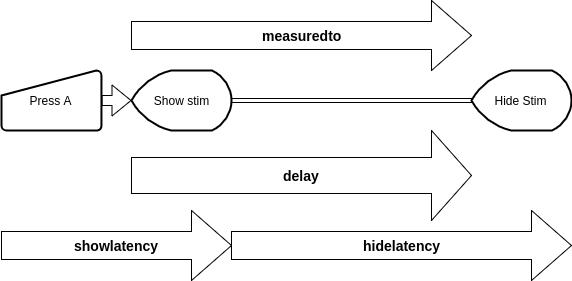

### Experiment 3 - Can timers be trusted?
Timers in javascript are notorious for being inaccurate.
The inaccuracy stems from two things: first, browsers update their internal timer only at [specific intervals](https://developer.mozilla.org/en-US/docs/Web/API/WindowOrWorkerGlobalScope/setTimeout#Reasons_for_delays_longer_than_specified),
therefore timeouts can only trigger on these intervals .
This is especially problematic on windows (older windows?) where the polling occurs only every 15ms or so.
The second problem is that javascript is sensitive to background activity,
and external tasks may grab the time where a timeout was supposed to fire.

# experiment 1 (timeout)
This experiment lets a player measure its own timeout latency.
In this experiment the player will trigger a timeout after a predefined period of 50/150/300/800 ms, and measure the logged duration.
In addition to testing minno, the same experiment will be repeated in vanilla JavaScript. 
This is done in order to establish if lag is the result of browser limitations or the player design.

The fields for the csv in this experiment are as follows:

Name            | Source    | Units  | Description
--------------- | --------- | ------ | -----------
Measurement     | player    | String | The name of the measure (minno|vanilla)
delay           | player    | ms     | The length of the timeout as set in the player
latency         | player    | ms     | The measured latency of the delay

The results can be found in the [results folder](./results)
The `Measurement` field does not exist in the [opensesame file](./results/open-timeout.csv).

Notably, tabs out of focus immediately lose the validity of their timers (see for example [here](http://stackoverflow.com/questions/15871942/how-do-browsers-pause-change-javascript-when-tab-or-window-is-not-active).
In particular Safari is sensitive to this and clamps all timeouts after about three minutes without active user interactions (in the tests we use an input to simulate user input).

# experiment 2 (timeout-visual)
This experiment tests the accuracy of a players ability to display a stimulus for a set time.
In the experiment the player waits for a keypress and then displays the stimulus for a preset time (100/110/150/400/800 ms).
The arduino then measures the actual time that the stimulus was displayed.

The arrows in the diagram represent the various measures as described in the following table:

Name            | Source    | Units  | Description
--------------- | --------- | ------ | -----------
showlatency     | arduino   | us    | The latency between the keypress and the appearance of the stimulus.
hidelatency     | arduino   | us    | The latency between the appearance of the stimulus and its dissapearance.
delay           | player    | ms    | The delay time set in the player for the display of the stimulus
measuredto      | player    | ms    | The time measured by the player that the stimulus was displayed (at this time simply a measurement of timer accuracy).

The results can be found in the [results_visual folder](./results_visual)

The hideLatency (display duration) can be either higher or lower than required.
It will be higher if the request was made at the end of a frame and ended at the beginning of a frame.
It will be lower if the request was made at the beginning of a frame and ended at the end of a frame.
